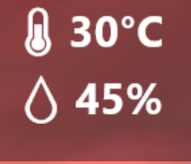

<h1 style="text-align: center;">🌡 Temperature Display</h1>
This project allows you to connect a DHT11 temperature/humidity sensor to a Rainmeter skin to conveniently display your room temperature on your desktop. Note that this is a Windows only solution.  

The provided Rainmeter skin is stylized to fit in with my other Rainmeter skin, [Delta](https://www.github.com/supercam19/Delta).
  

</img>

## 📝 Prerequisites
1. An Arduino board and a DHT11 temperature sensor
2. The [Arduino IDE](https://www.arduino.cc/en/software)
3. [Rainmeter](https://www.rainmeter.net/)

## 🔌 Setup
1. Assemble your Arduino circuit like so:
  

2. Download the [Arduino code](https://github.com/supercam19/TemperatureDisplay/releases/latest)

3. If you want to output the temperature in fahrenheit, uncomment the 'printFahrenheit()' line and comment out the 'printCelsius()' line. If you did not use digitalPin 2, make sure to change that at the top of the file. Upload the code to your Arduino. Take note of which Serial port it is on.
4. Download the [Rainmeter skin](https://github.com/supercam19/TemperatureDisplay/releases/latest) and double click the file to install it through the Rainmeter installer.

5. The default port for reading is COM3, if that is not the one you used, go to Documents/Rainmeter/Skins/TemperatureDisplay/readCOM.ps1 and change the portName at the top of the file to the one your Arduino is connected to